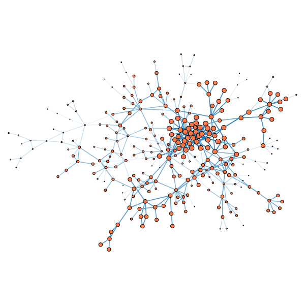

# network-archaeology

A collection of algorithms for inferring the history of random networks generated by the generalized preferential attachment model.

Pull requests are welcome.

## Table of content

1. [Usage](#usage)
  1. [Dependencies](#dependencies)
  2. [Compilation](#compilation)
  3. [Repository layout and sample code](#repository-layout-and-sample-code)
2. [Paper](#paper)

## Usage

### Dependencies

* `python3`
* `networkx2.0`
* `cmake` (to build the sampler)
* [SamplableSet](https://github.com/gstonge/SamplableSet) (used for the SMC sampler) 

### Compilation

The code is written in `python`, but it interfaces with a number of executables written in `C++`.
These should be compiled prior to using the package.
We provide a simple script `compile.sh` that will compile everything.

### Repository layout and sample code

* `example.py` is script that showcases how to use the code available in this repository. The function `consistency_check.run(...)` carries out every step of the process automatically (network construction, obfuscation, inference, de-obfuscation, comparison). One simply needs to specify the generative model (`generalized_gn` or `gn`), its parameters (`b` and `gamma`, via a `dict`), and the inference technique to use (available: `degree, OD, snowball_sampling`).

* `tools/` contains python wrappers around all important parts of the software. These modules can be imported separately if only parts of the consistency check pipeline are needed.

* `generator/` contains C++ code to generate networks from various growth models (many of which are not discussed in the paper below). A wrapper is available in `tools`.

## Paper

**Network archaeology: phase transition in the recoverability of network history**

J.-G. Young, G. St-Onge, E. Laurence, C. Murphy, L. Hébert-Dufresne and P. Desrosiers 
[arXiv:1803.09191](https://arxiv.org/abs/1803.09191) (2019)

